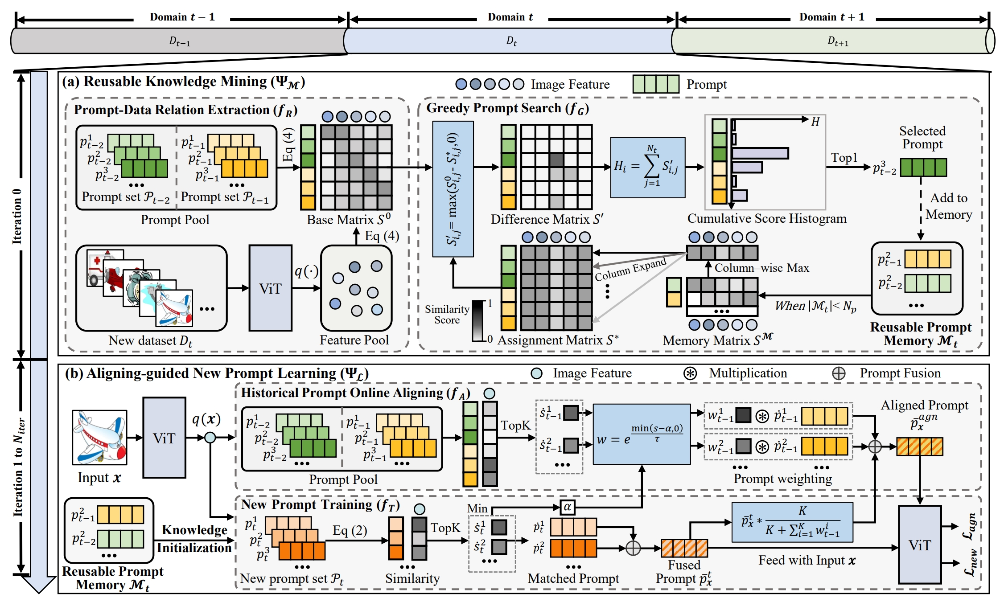
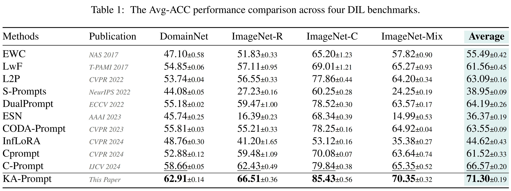

# [ICML2025] Componential Prompt-Knowledge Alignment for Domain Incremental Learning

<div align="center">

<div>
      Kunlun Xu<sup>1</sup>&emsp; Xu Zou<sup>2</sup>&emsp; Gang Hua<sup>3</sup>&emsp; Jiahuan Zhou<sup>1*</sup>
  </div>
<div>

  <sup>1</sup>Wangxuan Institute of Computer Technology, Peking University, Beijing, China&emsp; <sup>2</sup>School of Artificial Intelligence and Automation, Huazhong University of Science and Technology, Wuhan, China&emsp; <sup>3</sup>Amazon.com, Inc, Bellevue, WA 98004, USA

</div>
</div>
<p align="center">
  <a href='https://arxiv.org/abs/2505.04575'></a>
</p>

The *official* repository for  [Componential Prompt-Knowledge Alignment for Domain Incremental Learning](https://arxiv.org/abs/2505.04575).




## Installation
```shell
conda create -n DIL python=3.9
conda activate DIL
pip install torch==2.4.0 torchvision==0.19.0 torchaudio==2.4.0 --index-url https://download.pytorch.org/whl/cu118
pip install -r requirements.txt
```


### Data and Model Preparation

This work primarily utilizes DomainNet, ImageNet-R, ImageNet-C, and ImageNet-Mix. Among them, DomainNet, ImageNet-R, and ImageNet-C are existing datasets. ImageNet-Mix is a dataset we constructed based on ImageNet-R and ImageNet-C. And you can download DomainNet at [here](https://ai.bu.edu/M3SDA/), ImageNet-R at [here](https://github.com/hendrycks/imagenet-r?tab=readme-ov-file) and ImageNet-C at [here](https://github.com/hendrycks/robustness?tab=readme-ov-file). To facilitate your use of our code, we have included the training-testing sample split files for each domain of each dataset in ./dataset/image_list/.


Then your data directory should be organized in the following format:

- **you_data_path**
  - *DomainNet*
  - *ImageNet-R*
  - *ImageNet-C*

The pre-trained model weights can be downloaded at [here](https://huggingface.co/google/vit-base-patch16-224-in21k).


### KA-Prompt
You can directly run the pre-written shell script:
```
sh scripts/DomainNet.sh
sh scripts/ImageNet-R.sh
sh scripts/ImageNet-C.sh
sh scripts/ImageNet-Mix.sh
```


## Results
The following results were obtained with a single NVIDIA 4090 GPU:



## Citation
### If you find this code useful for your research, please cite our paper.

@article{xu2025comp,
  title={Componential Prompt-Knowledge Alignment for Domain Incremental Learning},
  author={Xu, Kunlun and Zou, Xu and Hua, Gang and Zhou, Jiahuan},
  booktitle={ICML}, 
  year={2025}
}

## Acknowledgement
Our code is based on the PyTorch implementation of [C-Prompt](https://github.com/zhoujiahuan1991/IJCV2024-C-Prompt). 

## Contact

For any questions, feel free to contact us (xkl@stu.pku.edu.cn).

Welcome to our Laboratory Homepage ([OV<sup>3</sup> Lab](https://zhoujiahuan1991.github.io/)) for more information about our papers, source codes, and datasets.
